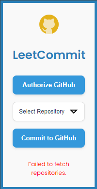
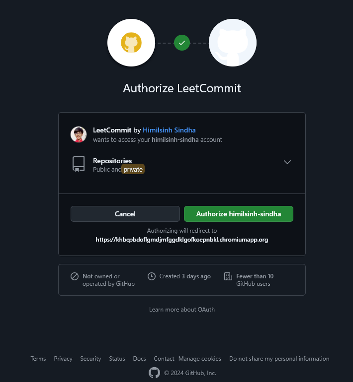
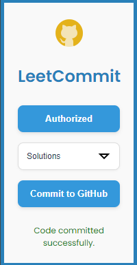

<p align="center">
  
<h1 align="center">LeetCommit</h1>
<p align="center">
  <i>Automate Your LeetCode Submissions to GitHub 🚀</i>
</p>


**LeetCommit** is a Chrome extension that allows you to commit your LeetCode solutions directly to your GitHub repository. This extension simplifies the process of saving your coding solutions by automating the commit process.

## Features

- **Authorize with GitHub** to access your repositories (authorization needed only once). The extension saves your authorization details and the last selected repository for convenience. 🔑
- **Automatically fetch the problem title** and use it as the filename. (Currently, it supports only C++ code.) 📄
- **Commit your LeetCode solutions** with a single click. ✅
- **Update existing solutions** if the file already exists in the repository. 🔄

## Screenshots

Here are some screenshots showcasing the features of **LeetCommit**:

<table align="center">
  <tr>
    <td align="center">
      
      <br/>
      <i>LeetCommit Startup Interface 🌟</i>
    </td>
    <td align="center">
      
      <br/>
      <i>GitHub Authorization 🔓</i>
    </td>
    <td align="center">
      
      <br/>
      <i>After Successful Commit 🎉</i>
    </td>
  </tr>
</table>

## Installation

### Install from GitHub

1. Clone or download this repository to your local machine.

   ```bash
   git clone https://github.com/himilsinh-sindha/LeetCommit-Extension.git
   ```

2. Open Google Chrome and navigate to `chrome://extensions/`.

3. Toggle **Developer Mode** on (top right corner).

4. Click on **Load unpacked** and select the folder where you cloned/downloaded the extension (the root folder containing `manifest.json`).

5. The **LeetCommit** extension will now appear in your Chrome extensions list.

## Usage

1. **Solve a Problem on LeetCode**: Go to [LeetCode](https://leetcode.com) and solve any problem. 🧩
2. **Submit Your Solution**: After solving the problem, ensure it is successfully submitted and the code along with the analysis is visible on the screen. 📝
3. **Open LeetCommit**: Click on the **LeetCommit** extension icon in your browser toolbar. 🔧
4. **Select Repository**: Choose the GitHub repository where you want to commit your solution. 📂
5. **Commit to GitHub**: Click on **Commit to GitHub**. Your solution will be automatically committed and pushed to the selected GitHub repository. 🚀

   - **Note**: If there is no successfully submitted code on LeetCode, the extension will display an error message: **"No code on screen"**. ⚠️

## Contributing

Contributions are always welcome! If you’d like to improve this project:

1. Fork the repository.
2. Create a new branch for your feature (`git checkout -b feature-branch`).
3. Make your changes and commit (`git commit -m 'Add new feature'`).
4. Push to the branch (`git push origin feature-branch`).
5. Open a pull request and describe the changes made.

## Issues

If you encounter any problems while using **LeetCommit**, feel free to open an issue [here](https://github.com/himilsinh-sindha/LeetCommit-Extension/issues). 🐛

## License

This project is licensed under the MIT License. See the [LICENSE](https://github.com/himilsinh-sindha/LeetCommit-Extension/blob/main/LICENSE) file for details. 📜

---

If you find **LeetCommit** useful, please consider giving it a ⭐️ on GitHub to support its development and future improvements! 🙌

